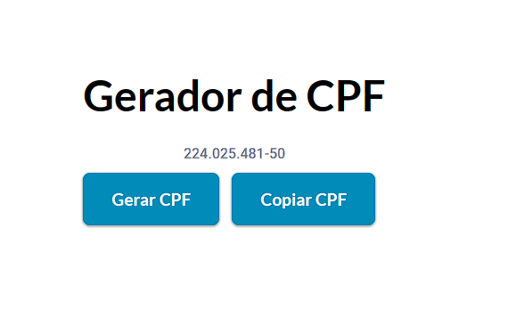

  

## Projeto Gerador de CPF - 📄
Projeto Gerador de CPF, totalmente responsivo, consiste em geral um CPF aleatório em clicar gerar CPF. Implementei tbm a função de copiá-lo quando clicar em copiar CPF.

## Tecnologias - 👨‍💻
- HTML 
- CSS
- JavaScript
- Git e Github